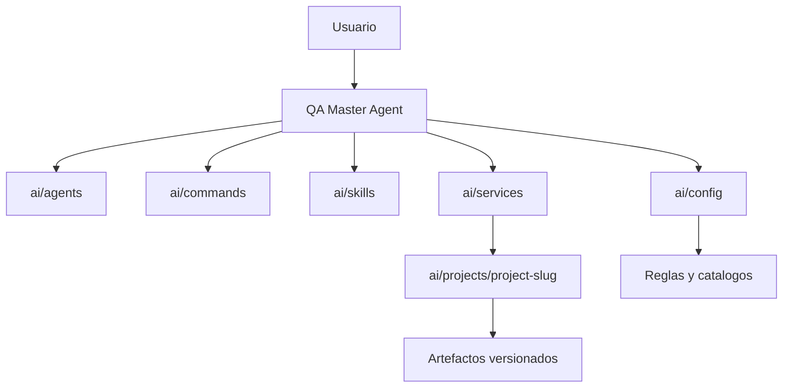
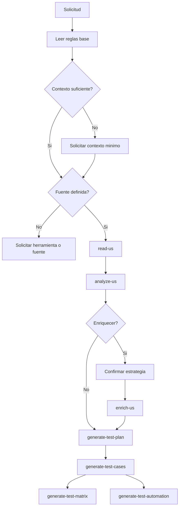
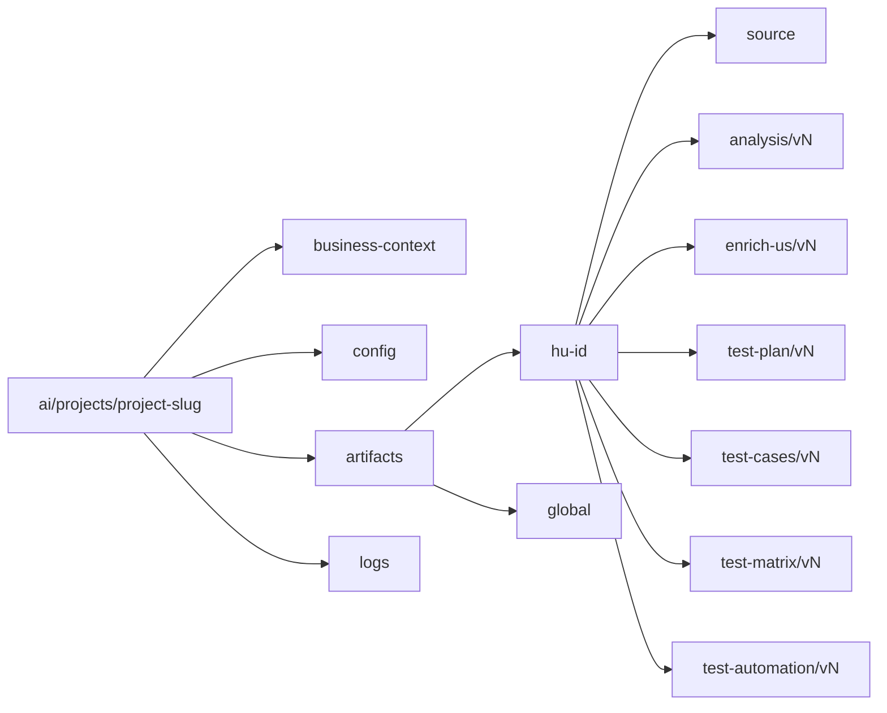

# QA AI Agent System

Sistema de agentes QA para trabajar Historias de Usuario de forma guiada, trazable, versionada y segura.

El repositorio define un ecosistema de agentes, comandos, skills, servicios, reglas y catalogos para actuar como un QA Lead especializado en QA funcional, QA automation, Agile QA, Spec-Driven Development, trazabilidad y generacion de artefactos reales.

Este README documenta la estructura y operacion del sistema. No debe documentar proyectos concretos ni contenido funcional de clientes; esos datos viven unicamente bajo `ai/projects/{project-slug}/`.

## Objetivo

Transformar Historias de Usuario y requerimientos en artefactos QA consistentes y reutilizables:

- lectura y normalizacion de HU
- analisis funcional y QA
- enriquecimiento funcional
- explicacion de requerimientos
- planes de prueba
- casos de prueba
- matrices de trazabilidad
- automatizacion QA
- summaries, metadata y logs de auditoria

El sistema no debe inventar reglas de negocio, funcionalidades, integraciones, validaciones ni decisiones tecnicas. Si falta informacion critica, debe detener el flujo y preguntar.

## Arquitectura

La estructura operativa vigente esta bajo `ai/`.

No usar rutas `.github/ai/...` para el flujo actual, configuraciones nuevas ni artefactos QA.

```text
ai/
  agents/
    qa-master-agent.md
    test-automation-agent.md
  commands/
    qa-run.md
    read-us.md
    analyze-us.md
    enrich-us.md
    explain-requirements.md
    generate-test-plan.md
    generate-test-cases.md
    generate-test-matrix.md
    generate-test-automation.md
    connect-planner.md
    planner-task.md
  services/
    context-service.md
    connection-service.md
    hu-service.md
    validation-service.md
    strategy-service.md
    prompt-service.md
    artifact-service.md
    versioning-service.md
    summary-service.md
    logging-service.md
    planner-mcp-service.md
  skills/
    read-us.md
    analyze-us.md
    enrich-us.md
    explain-requirements.md
    generate-test-plan.md
    generate-test-cases.md
    generate-test-matrix.md
    generate-test-automation.md
  config/
    agent-rules.md
    business.rules.md
    enrichment-options/
    qa-testplan-options/
    automation-options/
  projects/
    {project-slug}/
  scripts/
  sync_work_item.py
  ...
docs/
  architecture.md
  workflow.md
  integrations.md
  services.md
  versioning.md
```

## Carpetas principales

| Ruta | Proposito |
|---|---|
| `ai/agents/` | Define agentes orquestadores y especializados. |
| `ai/commands/` | Define comandos conversacionales ejecutables por intencion del usuario. |
| `ai/skills/` | Contiene capacidades especializadas para leer, analizar, enriquecer y generar artefactos. |
| `ai/services/` | Centraliza contexto, conexiones, validacion, persistencia, versionamiento, summaries y logs. |
| `ai/config/` | Contiene reglas globales y catalogos de estrategias, metodologias y frameworks. |
| `ai/projects/` | Persistencia por proyecto: contexto, configuracion no secreta, artefactos y logs. |
| `ai/scripts/` | Scripts auxiliares, utilidades y herramientas de soporte para sincronizacion y procesamiento. |
| `docs/` | Documentacion extendida de arquitectura, flujo, integraciones, servicios y versionamiento. |

## Agentes

| Agente | Archivo | Responsabilidad |
|---|---|---|
| QA Master Agent | `ai/agents/qa-master-agent.md` | Orquestar el flujo QA conversacional completo. |
| Test Automation Agent | `ai/agents/test-automation-agent.md` | Generar automatizacion QA desde HU, planes y casos existentes. |

El `QA Master Agent` actua como router conversacional. No debe concentrar logica pesada; debe delegar en comandos, skills, servicios y configuracion.

El `Test Automation Agent` solo debe automatizar con base en artefactos QA existentes. No debe inventar flujos, validaciones, endpoints, URLs ni secretos.

## Flujo QA obligatorio

El sistema trabaja como ciclo guiado, no como generador directo de respuestas.

1. Validar o crear contexto del proyecto.
2. Validar herramienta de gestion o fuente de HU.
3. Leer HU mediante `read-us`.
4. Analizar HU mediante `analyze-us`.
5. Enriquecer HU mediante `enrich-us`, solo si aplica y con estrategia confirmada.
6. Explicar requerimientos, si se necesita alineacion funcional.
7. Generar plan de pruebas con metodologia aprobada.
8. Generar casos de prueba.
9. Generar matriz individual o global.
10. Generar automatizacion QA, solo cuando existan HU enriquecida, plan y casos.

Si el usuario saluda o pide ayuda general y no existe proyecto activo, primero se solicita contexto minimo y herramienta de gestion. No se debe pedir ni procesar una HU todavia.

## Precondiciones

| Accion | Precondiciones |
|---|---|
| Configurar proyecto | Contexto minimo de negocio y herramienta o fuente de HU. |
| Leer HU | Proyecto activo y fuente definida. |
| Analizar HU | HU leida o proporcionada, normalizada y trazable. |
| Enriquecer HU | Analisis previo, suficiencia funcional y estrategia aprobada. |
| Explicar requerimiento | HU o requerimiento disponible, contexto y fuente definida. |
| Generar plan | HU disponible, informacion suficiente y metodologia aprobada. |
| Generar casos | Plan de pruebas existente o aprobacion explicita para casos preliminares. |
| Generar matriz | Casos de prueba existentes. |
| Generar automatizacion | HU enriquecida, plan de pruebas, casos de prueba y framework seleccionado. |

## Contexto minimo de proyecto

Antes de trabajar una HU debe existir contexto suficiente:

- nombre del proyecto
- objetivo de negocio
- dominio funcional
- usuarios involucrados
- funcionalidades principales
- flujo funcional principal
- restricciones conocidas
- integraciones conocidas
- criticidad funcional
- herramienta de gestion o fuente de HU

Herramientas o fuentes soportadas:

- Jira
- Azure DevOps
- Planner
- Trello
- Excel
- archivo local
- texto manual
- otra fuente indicada por el usuario

Incluso si la HU se pega en el chat, la fuente debe registrarse como `texto manual`.

## Persistencia por proyecto

Los proyectos son datos operativos locales bajo `ai/projects/{project-slug}/` y **no deben documentarse en este README**.

Este apartado describe **unicamente la plantilla estructural**:

```text
ai/projects/{project-slug}/
  business-context/
    business-context.md
    management-tool-context.md
    project-metadata.json
  config/
    tool-connection.json
  artifacts/
    {hu-id}/
      source/
      analysis/
      enrich-us/
      requirements-explanation/
      test-plan/
      test-cases/
      test-matrix/
      test-automation/
      summary.json
    global/
      test-plan/
      test-matrix/
      summary.json
  logs/
```

Todo artefacto aprobado debe versionarse sin sobrescribir:

```text
ai/projects/{project-slug}/artifacts/{hu-id}/analysis/v1/analysis.md
ai/projects/{project-slug}/artifacts/{hu-id}/test-cases/v1/test-cases.md
ai/projects/{project-slug}/artifacts/{hu-id}/test-automation/v1/
```

Para informacion de un proyecto concreto, consultar dentro de la carpeta del proyecto, no este README.

## Comandos

| Comando | Archivo | Proposito |
|---|---|---|
| `qa-run` | `ai/commands/qa-run.md` | Orquesta el flujo QA conversacional completo. |
| `read-us` | `ai/commands/read-us.md` | Lee y normaliza una HU desde la fuente definida. |
| `analyze-us` | `ai/commands/analyze-us.md` | Analiza claridad, vacios, riesgos, testeabilidad e INVEST. |
| `enrich-us` | `ai/commands/enrich-us.md` | Enriquece una HU usando estrategia aprobada. |
| `explain-requirements` | `ai/commands/explain-requirements.md` | Explica una HU o requerimiento sin modificarlo. |
| `generate-test-plan` | `ai/commands/generate-test-plan.md` | Genera plan de pruebas con metodologia aprobada. |
| `generate-test-cases` | `ai/commands/generate-test-cases.md` | Genera casos positivos, negativos, edge cases y candidatos de automatizacion. |
| `generate-test-matrix` | `ai/commands/generate-test-matrix.md` | Genera matriz individual o global de trazabilidad. |
| `generate-test-automation` | `ai/commands/generate-test-automation.md` | Genera automatizacion QA desde artefactos existentes. |
| `connect-planner` | `ai/commands/connect-planner.md` | Gestiona conexion Planner via MCP externo. |
| `planner-task` | `ai/commands/planner-task.md` | Crea o edita tareas Planner con aprobacion explicita. |

## Skills

| Skill | Archivo | Responsabilidad |
|---|---|---|
| `read-us` | `ai/skills/read-us.md` | Leer, validar, normalizar y clasificar HU. |
| `analyze-us` | `ai/skills/analyze-us.md` | Analizar HU sin modificarla. |
| `enrich-us` | `ai/skills/enrich-us.md` | Mejorar claridad, testeabilidad y trazabilidad de la HU. |
| `explain-requirements` | `ai/skills/explain-requirements.md` | Explicar hechos, vacios, supuestos y preguntas abiertas. |
| `generate-test-plan` | `ai/skills/generate-test-plan.md` | Crear planes de prueba aplicables y trazables. |
| `generate-test-cases` | `ai/skills/generate-test-cases.md` | Crear casos de prueba completos y verificables. |
| `generate-test-matrix` | `ai/skills/generate-test-matrix.md` | Relacionar HU, escenarios, casos, prioridades y cobertura. |
| `generate-test-automation` | `ai/skills/generate-test-automation.md` | Generar estructura y pruebas automatizadas trazables. |

## Servicios

| Servicio | Archivo | Responsabilidad |
|---|---|---|
| Contexto | `ai/services/context-service.md` | Gestionar contexto de negocio por proyecto. |
| Conexion | `ai/services/connection-service.md` | Validar herramientas externas y configuraciones no secretas. |
| HU | `ai/services/hu-service.md` | Resolver, normalizar y trazar Historias de Usuario. |
| Validacion | `ai/services/validation-service.md` | Validar precondiciones, suficiencia y consistencia. |
| Estrategia | `ai/services/strategy-service.md` | Seleccionar estrategias, metodologias y frameworks desde catalogos. |
| Prompt | `ai/services/prompt-service.md` | Centralizar construccion de prompts. |
| Artefactos | `ai/services/artifact-service.md` | Crear estructura y guardar artefactos aprobados. |
| Versionamiento | `ai/services/versioning-service.md` | Crear versiones sin sobrescribir. |
| Summary | `ai/services/summary-service.md` | Mantener resumen de artefactos y cambios. |
| Logs | `ai/services/logging-service.md` | Registrar eventos de auditoria. |
| Planner MCP | `ai/services/planner-mcp-service.md` | Definir contrato Planner mediante MCP externo. |

## Catalogos

| Catalogo | Archivo | Uso |
|---|---|---|
| Reglas globales | `ai/config/agent-rules.md` | Reglas operativas, seguridad, versionamiento y persistencia. |
| Reglas de negocio QA | `ai/config/business.rules.md` | Reglas funcionales para HU y artefactos QA. |
| Enriquecimiento | `ai/config/enrichment-options/strategy-catalog.json` | Estrategias para enriquecer HU. |
| Plan de pruebas | `ai/config/qa-testplan-options/strategytest-catalog.json` | Metodologias para planes de prueba. |
| Automatizacion | `ai/config/automation-options/automation-catalog.json` | Frameworks y niveles de automatizacion soportados. |

### Estrategias de enriquecimiento

Estrategia default: `clasica_scrum`.

Opciones:

- `clasica_scrum`
- `valor_3_preguntas`
- `escenarios_gherkin`
- `tecnico_funcional_nfr`
- `dor_lista_refinamiento`

Si el usuario no selecciona estrategia, el agente debe mostrar la default y pedir aprobacion. No debe aplicar fallback silencioso.

### Metodologias QA

Metodologia default: `basado_cobertura`.

Opciones:

- `agile`
- `tradicional_ieee`
- `basado_cobertura`
- `exploratorio`
- `orientado_automatizacion`

Si el usuario no selecciona metodologia, el agente debe mostrar la default y pedir aprobacion. No debe aplicar fallback silencioso.

### Frameworks de automatizacion

Framework default: `playwright-typescript`.

Opciones:

- `playwright-typescript`
- `playwright-python`
- `cypress`
- `pytest`

La automatizacion debe basarse en casos de prueba reales y mantener trazabilidad con la HU y los artefactos fuente.

## Integraciones

Las integraciones externas se configuran por proyecto mediante:

```text
ai/projects/{project-slug}/config/tool-connection.json
```

El archivo `.env` raiz puede contener secretos locales o variables de ejecucion, pero no define por si solo el proyecto activo.

### Jira

Contrato no secreto recomendado:

```json
{
  "provider": "jira",
  "auth_mode": "api_token_env",
  "base_url": "",
  "project_key": "",
  "project_name": "",
  "user_email": "",
  "auth_ref": {
    "url_env": "JIRA_URL",
    "user_env": "JIRA_USER",
    "token_env": "JIRA_TOKEN"
  }
}
```

Reglas clave:

- validar `base_url`, `project_key` e `issue.key`
- no asumir que `.env` corresponde al proyecto activo
- detener el flujo si Jira no devuelve la issue real
- no guardar tokens en artefactos, summaries, contexto ni configuracion versionada

### Azure DevOps

Contrato no secreto recomendado:

```json
{
  "provider": "azure-devops",
  "auth_mode": "pat_env",
  "organization_url": "",
  "project": "",
  "team": "",
  "work_item_type": "User Story",
  "auth_ref": {
    "org_url_env": "AZURE_DEVOPS_ORG_URL",
    "project_env": "AZURE_DEVOPS_PROJECT",
    "pat_env": "AZURE_DEVOPS_PAT"
  }
}
```

Reglas clave:

- normalizar IDs tipo `ADO-12345` a `12345`
- validar `organization_url`, `project` y `System.Id`
- detener el flujo si Azure DevOps no devuelve el Work Item real
- usar `tags`, no `labels`, para metadata QA
- no guardar PATs en artefactos, summaries, contexto ni configuracion versionada

### Planner via MCP

Planner se soporta mediante MCP externo y login por navegador.

Reglas clave:

- usar `ai/services/planner-mcp-service.md`
- validar sesion antes de leer tareas
- usar `Tasks.Read` para lectura
- usar `Tasks.ReadWrite` para crear o editar
- no guardar tokens, refresh tokens, cookies ni secretos
- crear o editar tareas solo con aprobacion explicita
- usar ETag/`If-Match` para actualizar tareas o detalles

## Seguridad

Prohibido guardar o mostrar:

- tokens
- passwords
- client secrets
- refresh tokens
- cookies
- credenciales completas

Las configuraciones por proyecto solo deben guardar metadata no secreta y referencias a variables de entorno cuando aplique.

## Diagramas

### Arquitectura general



### Flujo conversacional



### Persistencia



## Documentacion extendida

| Archivo | Contenido |
|---|---|
| `docs/architecture.md` | Arquitectura del sistema. |
| `docs/workflow.md` | Flujo operativo QA. |
| `docs/integrations.md` | Contratos y reglas de integraciones. |
| `docs/services.md` | Responsabilidades de servicios. |
| `docs/versioning.md` | Reglas de versionamiento. |
| `docs/roadmap.md` | Roadmap tecnico por versiones. |
| `docs/capabilities.md` | Catalogo oficial de capacidades. |
| `docs/architecture-evolution.md` | Reglas para evolucionar la arquitectura. |
| `docs/releases.md` | Historial de releases del producto. |
| `docs/backlog.md` | Backlog priorizado por epicas, features y tareas. |

## Scripts y herramientas

La carpeta `ai/scripts/` contiene utilidades auxiliares para:

- sincronizacion con sistemas externos (Jira, Azure DevOps, etc.)
- procesamiento de artefactos
- automatizacion de tareas repetitivas
- mantenimiento del repositorio

Ejemplo:

- `sync_work_item.py` - sincroniza issues desde Jira o Azure DevOps a artefactos locales

Los scripts no son parte del flujo conversacional directo, pero pueden ser invocados por servicios o comandos cuando aplique.

## Archivos raiz

| Archivo | Proposito |
|---|---|
| `AGENTS.md` | Instrucciones universales del repositorio para cualquier agente o modelo. |
| `memory.md` | Memoria evolutiva del agente QA. |
| `.env.example` | Ejemplo de variables de entorno sin secretos reales. |
| `README.md` | Documentacion funcional y operativa del repositorio. |

## Uso esperado

El usuario puede escribir en lenguaje natural:

```text
Necesito configurar un proyecto QA.
Lee esta HU.
Analiza esta historia.
Enriquece la HU con estrategia clasica Scrum.
Genera el plan de pruebas.
Crea casos positivos, negativos y edge cases.
Genera la matriz global exportable a Excel.
Genera automatizacion con Playwright.
```

El agente debe detectar la intencion, validar precondiciones, explicar bloqueos si existen y guiar al siguiente paso correcto.

## Estado operativo

El flujo actual esta definido por archivos Markdown de agentes, comandos, servicios, skills y configuracion.

Las integraciones externas deben tratarse como contratos operativos: antes de leer, crear, editar o sincronizar informacion externa se debe validar configuracion, permisos y aprobacion del usuario.

La ruta oficial para persistencia es:

```text
ai/projects/{project-slug}/
```
