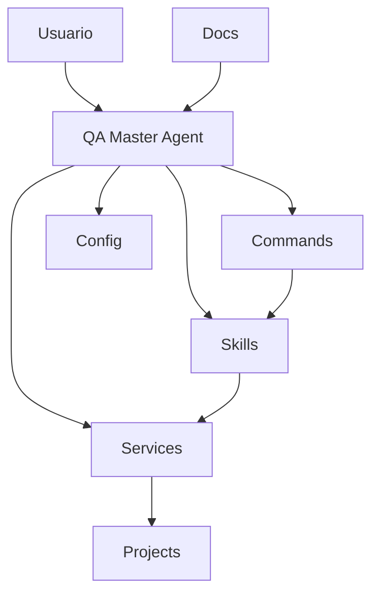

# Arquitectura del Sistema QA AI

## Vision General

AGENT-QA esta disenado como una arquitectura modular multiagente orientada a:

- desacoplamiento;
- mantenibilidad;
- trazabilidad;
- versionamiento;
- escalabilidad;
- soporte multi-proyecto;
- compatibilidad multi-modelo.

La arquitectura separa responsabilidades entre orquestacion, comandos, logica QA especializada, servicios reutilizables, configuracion, persistencia y scripts de soporte.

## Estructura Oficial

La ruta activa del sistema es `ai/`.

```text
ai/
  agents/
  commands/
  skills/
  services/
  config/
  projects/
  scripts/
docs/
```

No usar rutas `.github/ai/...` para el flujo actual, artefactos nuevos, configuraciones ni referencias internas.

## Pilares del Sistema



## Agents

Los agents definen identidad, responsabilidades, restricciones y coordinacion de alto nivel.

| Agent | Responsabilidad |
|---|---|
| `qa-master-agent.md` | Orquestador conversacional principal; valida contexto, detecta intencion y delega. |
| `test-automation-agent.md` | Especialista en generacion de automatizacion QA ejecutable y trazable. |

El QA Master no debe contener logica pesada. El Test Automation Agent no debe inventar flujos, endpoints, URLs, secretos ni validaciones.

## Commands

Los commands representan puntos de entrada operativos. Interpretan acciones, validan precondiciones y delegan a skills o services.

Ejemplos:

- `qa-run.md`
- `read-us.md`
- `analyze-us.md`
- `enrich-us.md`
- `generate-test-plan.md`
- `generate-test-cases.md`
- `generate-test-matrix.md`
- `generate-test-automation.md`
- `connect-planner.md`
- `planner-task.md`

## Skills

Los skills implementan capacidades QA especializadas y generan resultados o artefactos trazables.

Capacidades actuales:

- lectura y normalizacion de HU;
- analisis de HU;
- enriquecimiento;
- explicacion de requerimientos;
- generacion de planes;
- generacion de casos;
- generacion de matrices;
- generacion de automatizacion.

## Services

Los services centralizan logica reutilizable y transversal.

```mermaid
flowchart TD
    MASTER[QA Master Agent]
    MASTER --> CONTEXT[context-service]
    MASTER --> CONNECTION[connection-service]
    MASTER --> HU[hu-service]
    MASTER --> VALIDATION[validation-service]
    MASTER --> STRATEGY[strategy-service]
    MASTER --> PROMPT[prompt-service]
    MASTER --> ARTIFACT[artifact-service]
    MASTER --> VERSIONING[versioning-service]
    MASTER --> SUMMARY[summary-service]
    MASTER --> LOGGING[logging-service]
    MASTER --> PLANNER[planner-mcp-service]
    MASTER --> API[api-analysis-service]
    MASTER --> LOCATOR[locator-service]
    MASTER --> DATA[test-data-service]
    MASTER --> EXECUTION[test-execution-service]
```



Los services no son artefactos de usuario final; son contratos reutilizables para mantener consistencia.

## Config

`ai/config/` contiene reglas, catalogos y templates:

- reglas globales: `agent-rules.md`, `business.rules.md`;
- estrategias de enriquecimiento;
- metodologias QA para planes;
- frameworks de automatizacion;
- templates Playwright TypeScript.

Los catalogos permiten evolucionar opciones sin cambiar la arquitectura.

## Projects

`ai/projects/{project-slug}/` mantiene persistencia operativa por proyecto:

- contexto de negocio;
- configuracion no secreta;
- artefactos versionados;
- summaries;
- logs;
- evidencias.

Los datos de proyectos concretos no deben documentarse en README general salvo como ejemplo estructural.

## Scripts

`ai/scripts/` contiene utilidades auxiliares, por ejemplo sincronizacion y procesamiento masivo. Los scripts deben respetar las mismas reglas de seguridad, trazabilidad y no almacenamiento de secretos.

## Compatibilidad Multi-Modelo

AGENT-QA debe comportarse de forma consistente independientemente del modelo usado. La consistencia se logra con:

- reglas centralizadas;
- commands estructurados;
- skills desacoplados;
- services reutilizables;
- prompts estandarizados;
- validaciones obligatorias;
- persistencia versionada.

## Beneficios

- Consistencia funcional.
- Bajo acoplamiento.
- Mantenibilidad.
- Escalabilidad.
- Reutilizacion.
- Trazabilidad.
- Auditoria.
- Soporte multi-proyecto.

## Evolucion

La evolucion del sistema como producto se gobierna desde:

- `docs/roadmap.md`
- `docs/capabilities.md`
- `docs/architecture-evolution.md`
- `docs/releases.md`
- `docs/backlog.md`

La automatizacion QA es una capacidad especializada coordinada por `QA Master Agent` y delegada a `Test Automation Agent` cuando ya existen HU enriquecida, plan y casos de prueba.

