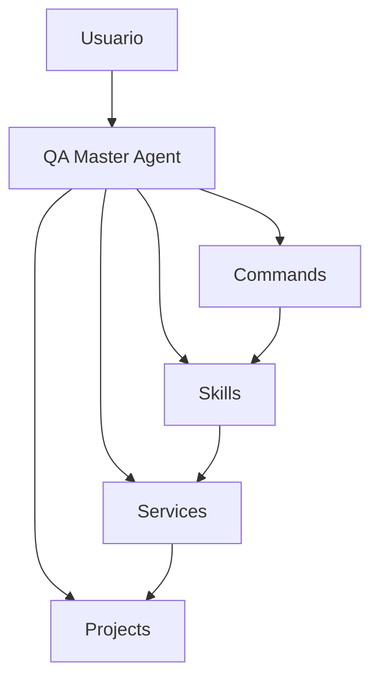
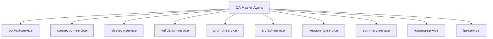
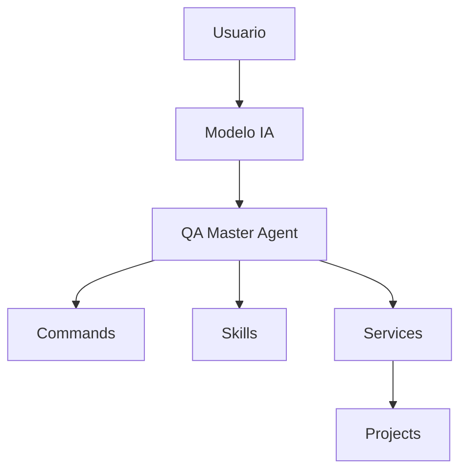

# Arquitectura del Sistema QA AI

## Visión General

El sistema está diseñado bajo una arquitectura modular multiagente orientada a:

- desacoplamiento
- mantenibilidad
- trazabilidad
- versionamiento
- escalabilidad
- soporte multi-proyecto

La arquitectura separa responsabilidades entre:

- orquestación
- comandos
- lógica QA
- servicios reutilizables
- persistencia

---

# Pilares del sistema

---

# QA Master Agent

## Responsabilidad

Es el orquestador principal del sistema.

Se encarga de:

- interpretar intención
- mantener continuidad conversacional
- validar contexto
- resolver proyecto activo
- coordinar services
- delegar a skills

---

# Commands

## Responsabilidad

Representan puntos de entrada del sistema.

Permiten:

- interpretar acciones
- activar workflows
- enrutar ejecución

## Ejemplos

- /read-us
- /analyze-us
- /enrich-us
- /generate-test-plan
- /generate-test-cases
- /generate-test-matrix

---

# Skills

## Responsabilidad

Implementan lógica QA especializada.

Ejemplos:

- análisis de HU
- enriquecimiento
- generación de planes
- generación de casos
- matrices de trazabilidad

---

# Services

## Responsabilidad

Centralizan lógica reutilizable y transversal.

---

# Projects

## Responsabilidad

Persistencia y trazabilidad completa.

Cada proyecto mantiene:

- contexto
- configuración
- artefactos
- logs
- versiones
- metadata

---

# Beneficios de la arquitectura

- Modularidad
- Escalabilidad
- Bajo acoplamiento
- Fácil mantenimiento
- Reutilización
- Trazabilidad
- Auditoría
- Soporte multi-proyecto
- Versionamiento profesional

---

# Compatibilidad Multi-Modelo

## Objetivo

Garantizar comportamiento consistente del sistema independientemente del modelo utilizado.

El sistema fue diseñado para funcionar de forma homogénea con distintos motores de IA, evitando diferencias importantes de comportamiento entre proveedores.

---

# Modelos soportados

- Codex
- Gemini
- GitHub Copilot
- Claude
- Otros modelos compatibles

---

# Estrategia aplicada

La consistencia entre modelos se logra mediante:

- separación de responsabilidades
- commands estructurados
- skills desacoplados
- services reutilizables
- prompts estandarizados
- reglas centralizadas
- validaciones obligatorias

---

# Arquitectura aplicada

---

# Beneficios

## Consistencia funcional

El sistema responde de forma similar sin depender del modelo IA específico.

---

## Bajo acoplamiento

La lógica funcional NO depende del proveedor IA.

---

## Mantenibilidad

Las reglas se mantienen centralizadas y reutilizables.

---

## Escalabilidad

Permite agregar nuevos modelos sin rediseñar la arquitectura.

---

# Resultado esperado

El usuario obtiene:

- comportamiento consistente
- flujos homogéneos
- misma estructura QA
- misma trazabilidad
- mismas validaciones
- misma persistencia

independientemente del modelo utilizado.

# pending -- automatización:

flowchart TD

    USER[Usuario]

    USER --> MASTER[QA Master Agent]

    MASTER --> READ[read-us]
    MASTER --> ANALYZE[analyze-us]
    MASTER --> ENRICH[enrich-us]
    MASTER --> PLAN[test-plan]
    MASTER --> CASES[test-cases]

    MASTER --> AUTOMATION[Test Automation Agent]