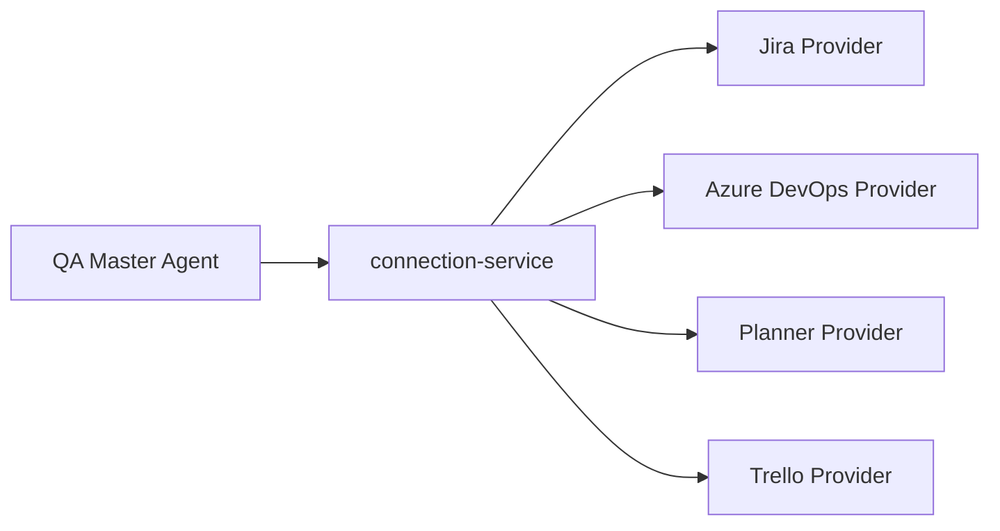

# Integraciones

## Objetivo

Permitir conexion segura con herramientas externas de gestion.

---

# Herramientas soportadas

- Jira
- Azure DevOps
- Planner
- Trello

---

# Arquitectura



---

# Seguridad

- credenciales enmascaradas
- persistencia controlada por proyecto
- validacion obligatoria antes de leer o escribir
- autorizacion explicita antes de sincronizar cambios
- secretos solo en `.env` o proveedor externo aprobado

---

# Azure DevOps

Azure DevOps debe configurarse por proyecto en:

```text
ai/projects/{project-slug}/config/tool-connection.json
```

Variables esperadas en `.env`:

- `AZURE_DEVOPS_ORG_URL`
- `AZURE_DEVOPS_PROJECT`
- `AZURE_DEVOPS_PAT`

El `PAT` nunca debe guardarse en `tool-connection.json`.

Antes de leer una HU:

1. Validar contexto de proyecto.
2. Validar `provider: azure-devops`.
3. Validar `organization_url` y `project`.
4. Normalizar ID `ADO-12345` a `12345` cuando aplique.
5. Leer el Work Item real desde Azure DevOps.
6. Confirmar que `System.Id` coincide con el ID solicitado.
7. Bloquear si falla autenticacion, permisos, proyecto o existencia del Work Item.

Azure DevOps usa `tags`, no `labels`, para metadata QA.

---

# Objetivo futuro

Integrar providers via MCP para automatizacion completa desde el chat cuando aplique.
