# Services del Sistema

## Objetivo

Centralizar logica reutilizable y transversal para que agents, commands y skills no dupliquen responsabilidades.

## Arquitectura

```mermaid
flowchart TD
    MASTER[QA Master Agent]
    AUTOMATION[Test Automation Agent]

    MASTER --> CONTEXT[context-service]
    MASTER --> CONNECTION[connection-service]
    MASTER --> HU[hu-service]
    MASTER --> VALIDATION[validation-service]
    MASTER --> STRATEGY[strategy-service]
    MASTER --> PROMPT[prompt-service]
    MASTER --> ARTIFACT[artifact-service]
    MASTER --> VERSIONING[versioning-service]
    MASTER --> SUMMARY[summary-service]
    MASTER --> LOGGING[logging-service]
    MASTER --> PLANNER[planner-mcp-service]

    AUTOMATION --> API[api-analysis-service]
    AUTOMATION --> LOCATOR[locator-service]
    AUTOMATION --> DATA[test-data-service]
    AUTOMATION --> EXECUTION[test-execution-service]
    AUTOMATION --> ARTIFACT
    AUTOMATION --> VERSIONING
    AUTOMATION --> SUMMARY
    AUTOMATION --> LOGGING
```

## Servicios

| Service | Responsabilidad | Invocado por |
|---|---|---|
| `context-service` | Gestion de contexto y proyecto activo. | QA Master, commands, skills. |
| `connection-service` | Validacion de herramientas externas y configuracion no secreta. | read/enrich flows, scripts de sincronizacion. |
| `hu-service` | Resolucion, normalizacion y trazabilidad de HU. | read/analyze/enrich/plan/cases/matrix/automation. |
| `validation-service` | Validaciones de contexto, HU, suficiencia, cobertura y consistencia. | QA Master, skills y automation. |
| `strategy-service` | Resolucion de estrategias, metodologias y frameworks desde catalogos. | enrich, test-plan, test-automation. |
| `prompt-service` | Construccion de prompts con contexto, artefactos y reglas. | skills generativos. |
| `artifact-service` | Creacion de estructura y persistencia de artefactos. | todos los skills que generan artefactos. |
| `versioning-service` | Versionado `vN` sin sobrescritura. | skills y automation. |
| `summary-service` | Actualizacion de summaries por HU, artefacto y ejecucion. | skills, automation y execution. |
| `logging-service` | Auditoria, eventos, errores y bloqueos. | todo flujo operativo. |
| `planner-mcp-service` | Contrato de lectura, creacion y edicion Planner via MCP. | commands Planner y read-us. |
| `api-analysis-service` | Analisis OpenAPI/Swagger para automatizacion API. | generate-test-automation. |
| `locator-service` | Estrategia de selectores UI para automatizacion. | Test Automation Agent y generate-test-automation. |
| `test-data-service` | Reglas y estructura de datos de prueba. | Test Automation Agent y generate-test-automation. |
| `test-execution-service` | Contrato de ejecucion, evidencias y resultados de automatizacion. | Test Automation Agent cuando se solicita validar tests. |

## Reglas

- Un service debe contener logica reutilizable, no contenido de una HU concreta.
- Los skills deben usar services para persistir, versionar, resumir y registrar logs.
- Los agents y commands no deben duplicar logica propia de services.
- Nuevos services solo deben crearse cuando la responsabilidad sea transversal y no exista en este catalogo.

