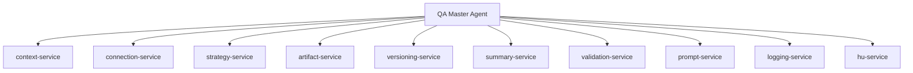

# Services del Sistema

## Objetivo

Centralizar lógica reutilizable y transversal.

---

# Arquitectura

---

# Servicios

| Service | Responsabilidad |
|---|---|
| context-service | Gestión de contexto |
| connection-service | Jira/Azure/Planner |
| strategy-service | Metodologías QA |
| artifact-service | Persistencia |
| versioning-service | Versionado |
| summary-service | Historial |
| validation-service | Validaciones |
| prompt-service | Construcción prompts |
| logging-service | Logs |
| hu-service | Resolución HU |

---

# Beneficios

- desacoplamiento
- reutilización
- mantenibilidad
- trazabilidad
- escalabilidad
- debugging sencillo