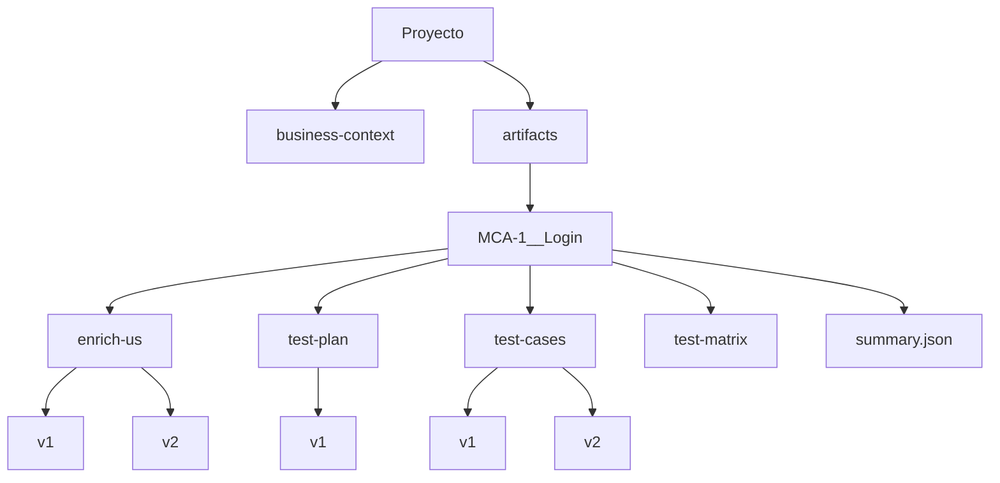

# Sistema de Versionamiento

## Objetivo

Mantener trazabilidad completa de todos los artefactos QA.

---

# Estructura

---

# Versionamiento

Cada artefacto:

- mantiene versiones
- conserva historial
- registra metadata
- genera summary

---

# Metadata registrada

- fecha
- hora
- usuario
- agente
- estrategia
- metodología
- summary de cambios

---

# Beneficios

- auditoría
- trazabilidad
- recuperación
- control de cambios
- mantenimiento histórico