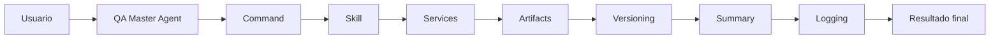
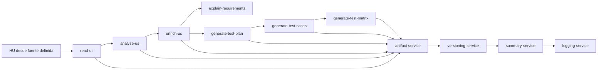
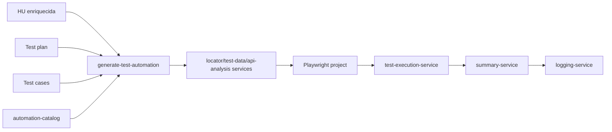

# Workflow QA

## Flujo General

## Flujo Funcional de HU

## Flujo de Automatizacion

## Etapas

1. Validar contexto de proyecto y fuente de HU.
2. Leer y normalizar HU.
3. Analizar suficiencia y riesgos.
4. Enriquecer solo con estrategia aprobada.
5. Explicar requerimiento cuando se necesita alineacion.
6. Generar plan con metodologia aprobada.
7. Generar casos con trazabilidad.
8. Generar matriz individual o global.
9. Generar automatizacion solo si existen HU enriquecida, plan y casos.
10. Ejecutar automatizacion solo bajo solicitud explicita y con precondiciones de ambiente.

## Persistencia

Todos los artefactos deben:

- tener ubicacion bajo `ai/projects/{project-slug}/artifacts/`;
- versionarse como `vN`;
- mantener metadata cuando el artefacto sea versionado;
- actualizar summary;
- registrar logs o evidencias de auditoria.

