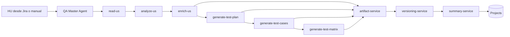

# Workflow QA

## Flujo General

---

# Etapas del flujo

## 1. Lectura de HU

La HU puede venir desde:

- Jira
- Azure DevOps
- Planner
- Trello
- entrada manual

---

## 2. Análisis

Se valida:

- estructura
- claridad
- INVEST
- criterios
- dependencias

---

## 3. Enriquecimiento

Se agregan:

- criterios de aceptación
- reglas de negocio
- edge cases
- escenarios alternativos

---

## 4. Generación de plan

Se aplica metodología QA:

- Scrum
- Dragonfly
- Risk Based
- IEEE
- híbridas

---

## 5. Generación de casos

Se generan:

- funcionales
- negativos
- API
- E2E
- edge cases

---

## 6. Matriz de trazabilidad

Se conecta:

- HU
- criterios
- planes
- casos

---

## 7. Persistencia

Todos los artefactos:

- se versionan
- generan metadata
- actualizan summary
- registran auditoría